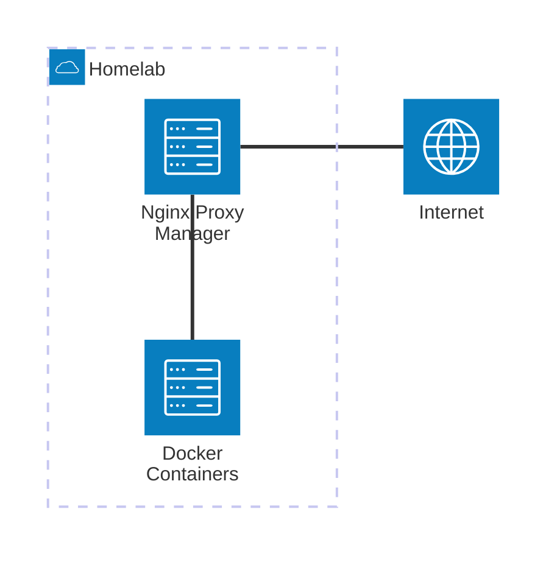

## Hardware
- Dell R720  
    - 2x20 Core CPU
    - 128GB RAM
    - 1TB SSD
    - Array 6x 9TB HHD

## VMs
- NAS
    - 16 vCPU
    - 64GB RAM
- Docker
    - 16 vCPU
    - 16GB RAM
- GitLab
    - 8 vCPU
    - 32GB RAM
- HomeAssistant
    - 8 vCPU
    - 4GB RAM

## Services
- Docker
- Vaultwarden
- Nginx Proxy Manager
- Portainer
- Immich
- Gitlab Runner
- Homepage
- Homebridge
- Lidarr
- Overseerr
- Sonarr
- Lidarr
- qBittorrent
- Bazarr

## Networking

### External Access
Services can be accessed by either a VPN or by the domain name. The WireGuard VPN server is hosted on the Ubiquiti Dream Machine Pro Router. When connecting through the domain name, requests are routed through the internet to the homelab’s public IP address. From there, the router forwards the traffic to the reverse proxy, which handles SSL termination and directs the request to the correct internal service based on the hostname or path. This allows multiple services to be hosted on the same IP while still being securely accessible from anywhere.  

